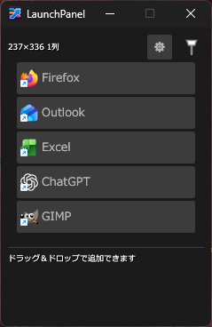
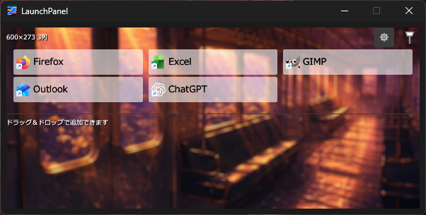

# LaunchPanel

LaunchPanelは、よく使うアプリ、ファイル、フォルダー、Webサイトを素早く開くためのWindows用ランチャーです。





## 特長

- ファイルやフォルダーのドラッグ＆ドロップ登録
- 登録先から取得したアイコンの表示
- 複数列に対応した自由なウィンドウ幅
- 背景画像、ボタン色、透過率、文字色、太字のカスタマイズ
- グローバルホットキー（初期値: `Ctrl + Alt + Shift + M`）
- ウィンドウのピン留めと、フォーカスを失った際の自動非表示
- タスクトレイ常駐と多重起動防止
- 設定の自動保存

## 動作環境

- Windows 10 / 11

## ビルド

[Rust](https://www.rust-lang.org/tools/install) 1.85以降をインストールし、リポジトリのルートで次を実行します。

```powershell
cargo build --release
```

完成した実行ファイルは `target/release/LaunchPanel.exe` に出力されます。実行ファイルを任意の書き込み可能なフォルダーへ置いて起動してください。

## 使い方

1. ファイルやフォルダーをウィンドウへドラッグ＆ドロップして登録します。
2. 登録されたボタンをクリックすると対象が開きます。
3. 歯車ボタンから表示やホットキーを変更できます。
4. 閉じるとウィンドウは非表示になり、タスクトレイまたはホットキーから再表示できます。

設定は実行時のカレントフォルダーに `LaunchPanel.json` として保存されます。旧バージョンの `launcher.json` がある場合は自動的に移行されます。

## 注意事項

- 背景画像は縦横ともに2000ピクセル未満の画像を指定してください。
- ホットキー設定の変更は次回起動時に反映されます。
- 現在はWindows専用です。

## 開発

```powershell
cargo fmt --check
cargo test
cargo clippy --all-targets --all-features -- -D warnings
```

## ライセンス

[MIT License](LICENSE)
