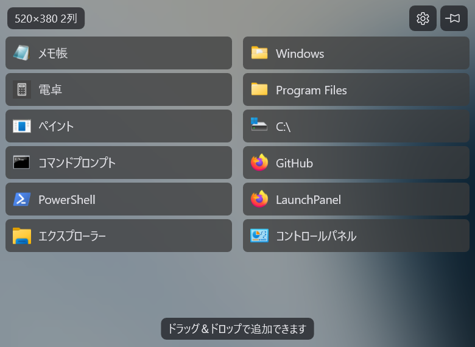
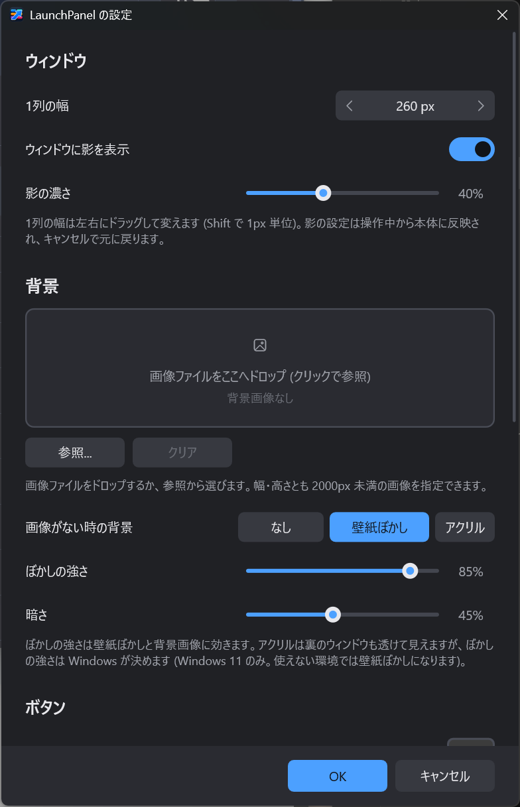

# LaunchPanel

[English](README.en.md) | 日本語

LaunchPanelは、よく使うアプリ、ファイル、フォルダー、Webサイトを素早く開くためのWindows用ランチャーです。

バージョン2では、Rust + Win32 + Direct2D / DirectWrite で全面的に作り直しました。実行ファイルは1MB未満の単体で、ランタイムなどのインストールは不要です。





## 特長

- 単体の実行ファイル (1MB未満)。.NETなどのランタイムやインストールは不要で、起動が速い
- ファイルやフォルダーのドラッグ＆ドロップ登録、登録先のアイコン表示
- ボタンのドラッグによる並び替え (他のボタンが滑らかに移動)
- 複数列に対応した枠なしウィンドウ。辺と四隅からのリサイズ、列単位へのスナップ
- 背景: 背景画像、壁紙ぼかし、アクリル (裏のウィンドウが透ける)。ぼかしの強さと暗さを調整可能
- ウィンドウの影 (濃さを調整可能)
- ボタン色、透過率、文字色、太字のカスタマイズ
- ボタンの色を標準と色1～5から選んで、視覚的にグループ分け (右クリックメニューか編集画面で割り当て)
- マウス操作だけで完結する設定画面 (スライダー、スイッチ、色の選択パネル、ドラッグ＆ドロップ)
- グローバルホットキー (初期値: `Ctrl + Alt + Shift + M`)
- デスクトップの空白をダブルクリックして、その位置に表示 (実験的機能)
- ピン留めと、フォーカスを失った際の自動非表示
- タスクトレイ常駐と多重起動防止
- 設定の自動保存

## v1からの主な変更点

- GUIをegui (OpenGL) から、Windows標準のDirect2D / DirectWriteによる自前描画へ変更し、実行ファイルを約4.9MBから1MB未満へ小さくしました。
- 設定ファイルは、実行ファイルと同じフォルダーに保存するようにしました (v1は実行時のカレントフォルダー)。起動方法やショートカットの作業フォルダーにかかわらず、同じ設定を読み書きします。
- 設定画面を作り直しました。文字や数値の直接入力欄はなく、マウス操作だけで設定できます。
- アイテムの編集画面を追加しました (名前の変更、ファイル・フォルダー・ブラウザーのリンクのドロップによるパスの変更)。
- 背景の壁紙ぼかし・アクリル、ウィンドウの影、ドラッグによる並び替えを追加しました。

## v1からの移行

v1の `LaunchPanel.json` はそのまま読み込めるので、基本的には実行ファイルを置き換えるだけで移行できます。

1. v1をタスクトレイのメニューの「終了」で完全に終了します (v1とv2は多重起動防止を共有しているため、v1が動いている間はv2が起動しません)。
2. 念のため、v1の `LaunchPanel.exe` と `LaunchPanel.json` を別の場所にコピーしておきます。
3. v1の `LaunchPanel.exe` をv2の `LaunchPanel.exe` で上書きして起動します。

アイテム、1列の幅、ホットキー、ボタンの色・透過率・太字、デスクトップのダブルクリックの設定はそのまま引き継がれます。

注意する点:

- **設定ファイルの場所**: v1は起動時のカレントフォルダーに、v2は実行ファイルと同じフォルダーに `LaunchPanel.json` を保存します。実行ファイルをダブルクリックして起動していた場合は同じ場所です。ショートカットの作業フォルダーを変えていた場合や自動起動で使っていた場合は、`LaunchPanel.json` が別の場所にあることがあるので、実行ファイルと同じフォルダーへ移してください。
- **ウィンドウの大きさ**: v1の設定にはウィンドウの大きさが記録されていないため、初回だけ既定の大きさで開きます。一度大きさを変えると、以降は記憶されます。
- **背景**: 背景画像を設定していた場合は、ぼかし・暗さなしで読み込むため見た目は変わりません。背景画像なしで使っていた場合はv2の既定 (壁紙ぼかし) になります。単色の背景にしたい場合は、設定画面の「画像がない時の背景」で「なし」を選んでください。
- **v1に戻す場合**: 実行ファイルを戻すだけで戻せます。v2で増えた設定項目はv1では無視されます。

## 動作環境

- Windows 10 / 11
- アクリルの背景はWindows 11で、Windowsの「透明効果」がオンの場合に有効です (使えない環境では壁紙ぼかしになります)。

## ダウンロード

[Releases](https://github.com/tamarx78-sys/LaunchPanel/releases) から `LaunchPanel-v2.2.0.zip` を取得し、`LaunchPanel.exe` を書き込み可能なフォルダーに置いて起動してください。

## ビルド

[Rust](https://www.rust-lang.org/tools/install) (stable) とVisual StudioのC++ビルドツールをインストールし、リポジトリのルートで次を実行します。

```powershell
cargo build --release
```

完成した実行ファイルは `target/release/LaunchPanel.exe` に出力されます。

## 使い方

1. ファイルやフォルダーをウィンドウへドラッグ＆ドロップして登録します。
2. 登録されたボタンをクリックすると対象が開きます。ボタンをドラッグすると並び替えられます。
3. ボタンの右クリックメニューから、編集・削除・ボタンの色の変更・上下の移動ができます。
4. 歯車ボタンから表示や背景、ホットキーを変更できます。
5. 上部の空いた部分をドラッグするとウィンドウを移動できます。端や四隅をドラッグするとサイズを変えられます。
6. 閉じるとウィンドウは非表示になり、タスクトレイまたはホットキーから再表示できます。完全に終了するにはタスクトレイのメニューから「終了」を選びます。

設定は実行ファイルと同じフォルダーに `LaunchPanel.json` として保存されます。旧バージョンの `launcher.json` がある場合は自動的に移行されます。

## 注意事項

- 背景画像は縦横ともに2000ピクセル未満の画像を指定してください。
- ホットキー設定の変更は次回起動時に反映されます。
- 実行ファイルは書き込みできるフォルダーに置いてください (`C:\Program Files` などでは設定を保存できません)。
- デスクトップのダブルクリック検出は、有効にした場合だけ低レベルのマウスフックを使います (入力は横取りせず、そのまま次へ渡します)。デスクトップのアイコン位置はUI Automationで調べます。
- 署名していない新しい実行ファイルのため、一部のウイルス対策ソフトが機械学習による判定で誤検知することがあります。
- 表示・非表示の動作 (理由や前面化の成否) を、実行ファイルと同じフォルダーの `LaunchPanel.log` に記録します。表示されない・隠れないなどの不具合が起きた時の調査に使います。
- 現在はWindows専用です。

## 開発

```powershell
cargo fmt --check
cargo test
cargo clippy --all-targets --all-features -- -D warnings
```

実機のデスクトップや壁紙を使う確認テストは、手動で実行します。

```powershell
cargo test --release -- --ignored --nocapture
```

製品仕様は [docs/SPECIFICATION.md](docs/SPECIFICATION.md) にあります。

## ライセンス

[MIT License](LICENSE)
